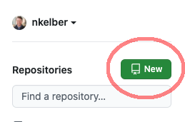

<param ve-config title="Documentation" component="default" class="documentation" fixed-header>

[<i class="fas fa-arrow-circle-left"></i> Home](/docs)

---

# Creating a Repository or Project in Juncture
First, login to Github on the Juncture home page. This may redirect you to GitHub if this is your first time logging in from Juncture.

Once logged in, click on the hamburger menu in the top righthand corner on the Juncture home page. Select `Create new site` from the list of options. A pop up will show that automatically fills the first field with your GitHub username. Type in a name for your website or project in the second field that says `Repository name to update or create`. Click the `Create Site` button.

Once you have created the site, you can access it at the below link. Please note that it may take up to one minute for the backend processing to finish and the site to load on Juncture.

> ```http://juncture-digital.org/your-user-name/your-repo-name```

# Create a Repository or Project in GitHub

1. Log into your account at [github.com](http://github.com)
2. In the upper left-hand corner, click on "New" to create a new repository.



3. Create a "Repository name" without spaces.
4. Optionally, add a description.
5. Confirm that the repository is public. 
6. Check the box under "Add a README file"
7. Finally, create the repository. 

**That's it! You've created a new visual essay site!**


# Viewing your Site

Your current visual essay site is based on a single document: README.md. The address for your website is based on the following construction:

> ```http://juncture-digital.org/your-user-name/your-repo-name```

Simply, fill in your own github user name and the name you used for your repository. For the next step, we will add some content using Markdown.

**Note:** It is possible to render your site on a custom domain. Contact us for direction here.

---
[<i class="fas fa-arrow-circle-left"></i> Home](/docs) | [An Introduction to the Visual Essay Tool <i class="fas fa-arrow-circle-right"></i>](/docs/authoring-intro)
